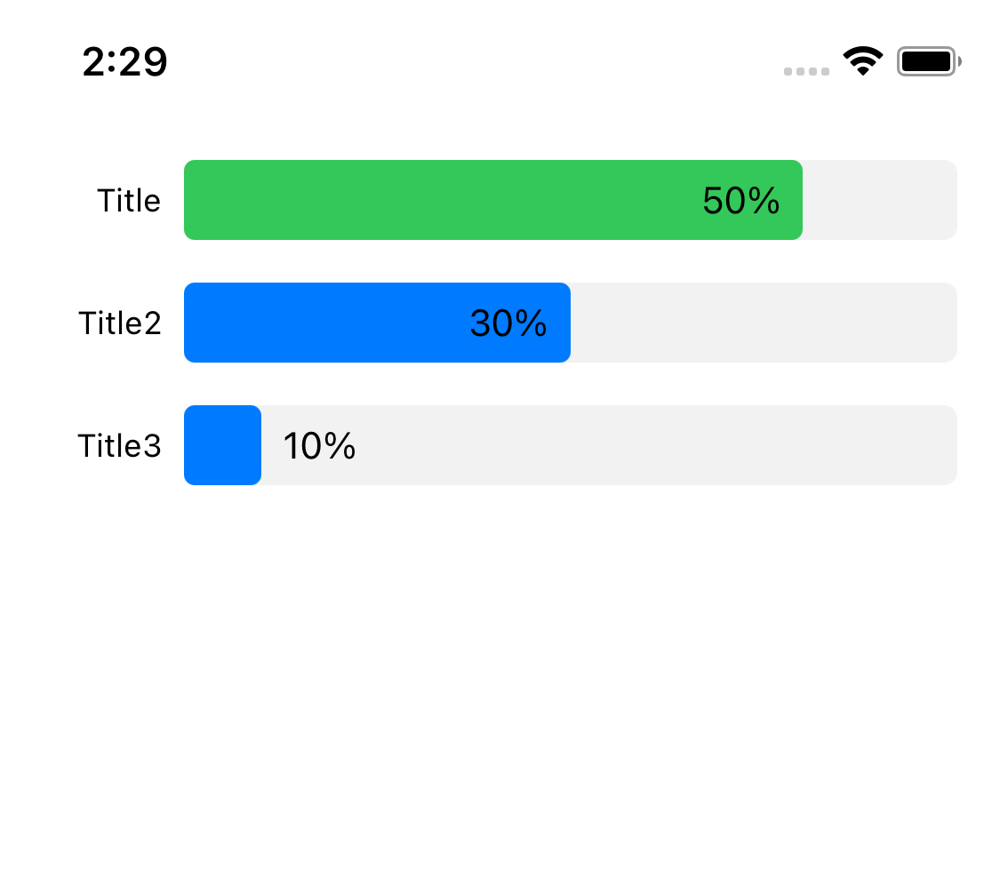

# ChartSwiftDemo
Demo for [ChartSwift](https://github.com/usk2000/ChartSwift)

## Screenshot



## Usage

```
struct ContentView: View {
    
    var items: [ChartItem] = [
        .init(title: "Title", value: 0.8, text: "50%", color: .green),
        .init(title: "Title2", value: 0.5, text: "30%", color: .blue),
        .init(title: "Title3", value: 0.1, text: "10%", color: .blue)
    ]
    
    var body: some View {
        VStack {
            BarChart.init(items: items)
            Spacer()
        }
        
    }
}

struct ContentView_Previews: PreviewProvider {
    static var previews: some View {
        ContentView()
            .environment(\.barBackground, Color.init(white: 0.95))
            .environment(\.barHeight, 30)
            .environment(\.labelWidth, 65)
    }
}
```

## License

Copyright 2020 Yuusuke Hasegawa

Licensed under the Apache License, Version 2.0 (the "License"); you may not use this file except in compliance with the License. You may obtain a copy of the License at

```
http://www.apache.org/licenses/LICENSE-2.0
```

Unless required by applicable law or agreed to in writing, software distributed under the License is distributed on an "AS IS" BASIS, WITHOUT WARRANTIES OR CONDITIONS OF ANY KIND, either express or implied. See the License for the specific language governing permissions and limitations under the License.
